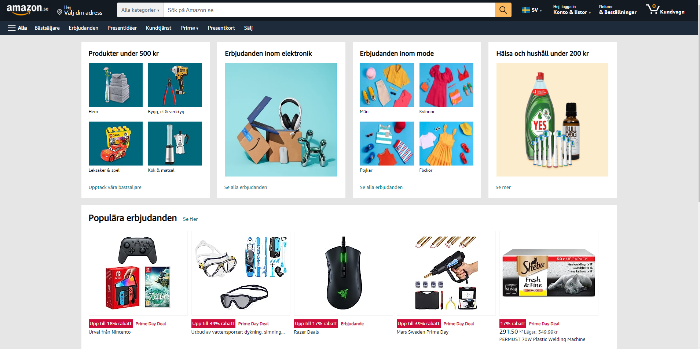
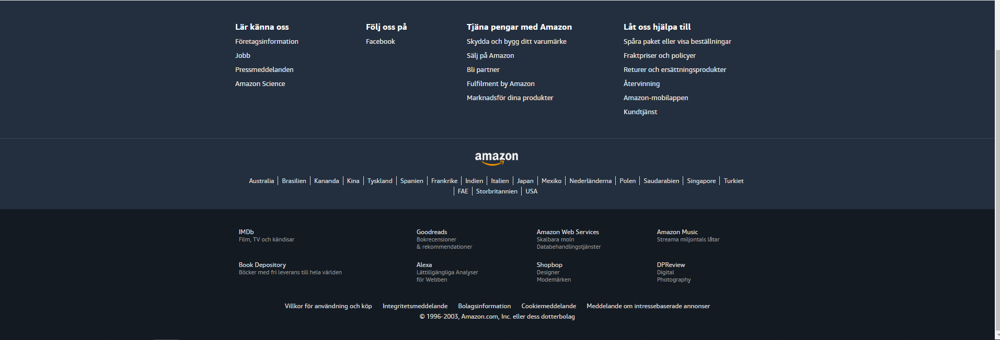

# Amazon Clone

Creating a copy of the homepage for amazon. Focusing on static elements using HTML and CSS.  
Project is used to learn the basics of HTML and CSS, with a focus on using different CSS properties to replicate the layout on a page. 

## Code structure

The code uses multiple css files to divide the page into different sections. Each section has its own css file. 
On the page we have the following sections:
- Header 
- Navbar
- Products
- Offers
- Footer

### Layout of page
Below is a image over the layout on the page.




Here we see the sections:
- Header, located at the top of the page.
- Navbar, located below the header and used to navigate to different parts of the website.
- Products, the main display of product categories.
- Offers, special offers displayed including information about their respective discounts.
- Footer, Located at the bottom of the page.

## Project Structure

The files in the project is structured into different folders to keep the root folder clean, except for the `amazon.html` file.

```

fonts/
  ...
Images/
  ...
Styles/
  footer.css
  general.css
  header.css
  navbar.css
  offers.css
  products.css
.gitignore
amazon.html
README.md

```

- The `fonts` folder contains additional files for fonts used on page.
- The `Images` folder contains all the images used on the page.
- `Styles` contains all the different css files, named after their different sections that they style. 

## Technologies Used
- HTML
- CSS